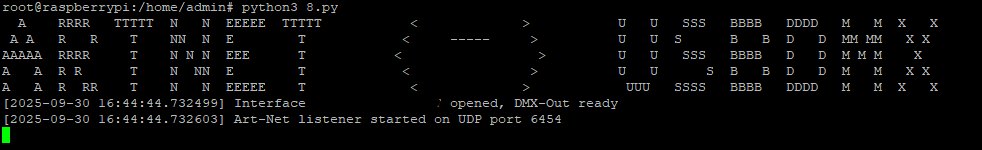

# ARTNET-TO-USBDMX
This Python program allows you to use the Digital Enlightenment FX5-USBDMX interface as an Art-Net node.

# Requirements:

A Linux-based system (e.g., Raspberry Pi) to run the script

The Digital Enlightenment FX5-USBDMX interface (other devices are not supported)

An external power supply for the interface if your machine’s USB ports do not provide sufficient power
(recommended: 9–12 V PSU)

# Setup:

Step 1: Download the repository e.g with git clone: git clone https://github.com/PigcraftTV/ARTNET-TO-USBDMX.git

Steo 2: Go into the directory: cd ARTNET-TO-USBDMX

Step 3: Connect your Interface to the Machine

Step 4: Get the Serial-Number of your Interface with this command: dmesg | grep -i usb

     The Output should look something like this:
     
     Couldn't open device, some information will be missing
     
     Couldn't open device, some information will be missing
     
     Couldn't open device, some information will be missing
     
     Couldn't open device, some information will be missing
     
     Couldn't open device, some information will be missing
     
       iManufacturer           1 Digital Enlightenment
       
        iProduct                2 USB DMX
        
        iSerial                 3 0000800010011617      <--- Serial Number
        
        bNumConfigurations      1
        
        Configuration Descriptor:
        
          bLength                 9
          
Step 5: Copy the Serial-Number and paste it in line 8 in the quotation marks: SERIAL_NUMBER = b"0000800010011617"

Step 6: Change the so_path to your directory.

Step 7: Additionally, you can change the ArtNet Universes.

Step 8: Now you can save and run the script with python3 usbdmx-artnet.py

# Autostart

Wuth the following steps, your Rapberry PI will automaticly start the converter as soon as it boots and  the interface ist plugged in.

Step 1: Create the .service file: nano /etc/systemd/system/artnet-to-usbdmx.service and paste this:

[Unit]
Description=Artnet to USB-DMX Autostart Service
After=network.target

[Service]
ExecStart=/usr/bin/python3 /home/admin/artnet-to-usbdmx.py  <-- You need to change this path according to your user and script directory
WorkingDirectory=/home/admin
User=admin
Restart=always
RestartSec=5
StandardOutput=journal
StandardError=journal

[Install]
WantedBy=multi-user.target

(In Nano press Str + O to save and Str + X to exit)

Step 2: Activate, reload and start the service: sudo systemctl daemon-reload
                                                sudo systemctl enable artnet-to-usbdmx.service
                                                sudo systemctl start artnet-to-usbdmx.service

Step 3: You can enter the log/status with: systemctl status artnet-to-usbdmx.service or journalctl -u artnet-to-usbdmx.service -f

# Notes:

The script generally works without installing additional dependencies.

# Problem Solving:

If you only encounter issues with the USBDMX to Artnet function, you might need to change the Broadcast Setting in your Switch or Router. Otherwise you can directly put in your Destination IP for Unicast.

If the Script says, that it cant open the interface, try to run it as root.

If you have problems or other issues, you can create a tab under "Issues" or send me an EMail: PigcraftTV50@gmail.com

Additionally, parameters such as operating mode or the Art-Net universe can be customized directly within the source code.

